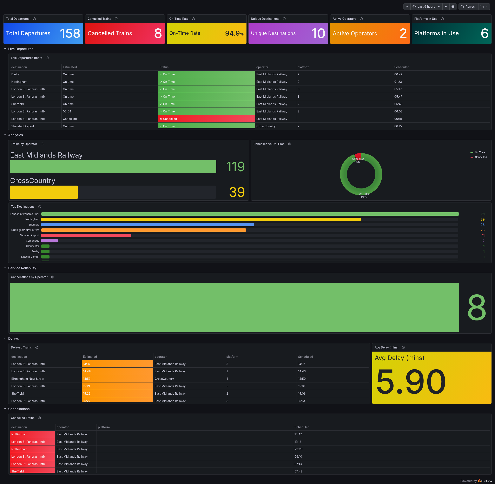

# 🚆 Azure Live Transit Monitor

An event-driven, zero-trust cloud data pipeline built on Microsoft Azure. This project tracks live train departures and delays for Leicester in real-time, buffering the data through a message queue and storing it in a NoSQL database for live visualization in Grafana.

*(Note: Environmental monitoring is planned for a future release!)*

## 🏗️ Architecture Overview

This system is designed using a **decoupled, microservice architecture** to ensure high availability and scalability.

1. **The Producer (Data Ingestion):** A containerized Python microservice that fetches real-time transit data from live APIs every 60 seconds and pushes it securely to an Azure Service Bus queue.
2. **The Message Broker:** Azure Service Bus acts as a shock absorber. If the database goes down, the Producer keeps pushing messages to the queue, ensuring zero data loss.
3. **The Consumer (Data Processing):** A second containerized Python microservice that listens to the queue, pulls off messages as they arrive, formats them, and saves them to the database.
4. **The Database:** Azure Cosmos DB (MongoDB API) provides serverless, highly scalable NoSQL document storage.
5. **The Dashboard:** Grafana Cloud connects directly to the Cosmos DB endpoint to provide live, auto-refreshing charts on transit delays and active trains.

## ✨ Key Enterprise Features

* **Zero-Trust Security:** Absolutely no passwords, API keys, or connection strings are hardcoded in the codebase. The Docker containers authenticate to the Azure Service Bus using **Azure Managed Identities** (Passwordless RBAC).
* **Infrastructure as Code (IaC):** The entire Azure environment (Resource Groups, Service Bus, Cosmos DB, Container Apps) is defined declaratively using **Terraform**, with state securely managed in an Azure Storage backend. 
* **State Protection:** Critical infrastructure like the Cosmos DB utilizes Terraform `prevent_destroy` lifecycle rules to prevent accidental data deletion during automated pipeline runs.
* **Separated CI/CD Pipelines:** Deployed via **GitHub Actions**. The pipeline features strict path filtering to prevent race conditions:
  * 🛠️ **Infra Pipeline:** Only runs when `.tf` files change. Handles Terraform Plan/Apply.
  * 🐳 **App Pipeline:** Only runs when Python/Docker files change. Builds a single Docker image and dynamically deploys it to both the Producer and Consumer containers using environment variables for routing.

## 🛠️ Technology Stack

* **Cloud Provider:** Microsoft Azure
* **Compute:** Azure Container Apps (Serverless Docker)
* **Messaging:** Azure Service Bus
* **Database:** Azure Cosmos DB (MongoDB API)
* **Infrastructure as Code:** Terraform
* **Language:** Python 3.11 (`azure-servicebus`, `pymongo`)
* **CI/CD:** GitHub Actions
* **Observability:** Grafana Cloud

## 📁 Repository Structure

```text
├── .github/workflows/
│   ├── terraform.yml      # CI/CD for Infrastructure
│   └── docker.yml         # CI/CD for Python Microservices
├── main.tf                # Azure resource definitions
├── providers.tf           # Azure/Terraform provider config
├── variables.tf           # Parameterized deployment variables
├── consumer.py            # Pulls from Service Bus, writes to Cosmos DB
├── producer.py            # Fetches API data, writes to Service Bus
├── main.py                # Subprocess router (determines container role)
├── Dockerfile             # Unified image for both Producer and Consumer
└── requirements.txt       # Python dependencies
```

## 📊 Live Dashboard
Data from Cosmos DB is visualized in a comprehensive Grafana dashboard, providing real-time observability into transit operations. The dashboard tracks:

* **Headline KPIs:** Live counters for Total Departures, Cancelled Trains, On-Time Rate, Unique Destinations, and Platforms in Use.
* **Live Tracking:** A real-time Departure Board detailing current train statuses, estimated arrivals, and platform assignments.
* **Analytics & Reliability:** Visual breakdowns of Trains by Operator, Top Destinations, and an overall On-Time vs. Cancelled ratio.
* **Delay & Cancellation Monitoring:** Dedicated tables isolating actively delayed or cancelled trains, alongside a live tracker for the Average Delay time across the network.


